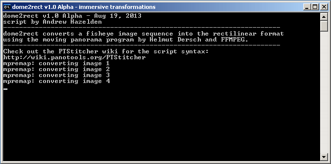
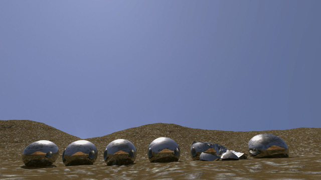

# Dome2rect v1.0 Alpha- Aug 19, 2013 #
by Andrew Hazelden

## Overview ##
Dome2rect is a command line script that uses the open source Panotool library + MPRemap  application to automate the process of converting image sequences between multiple panoramic formats. I created this script because I wanted to make it simpler to convert a fulldome movie trailer into a "flat screeen" rectilinear format for posting on sites like YouTube.

## Installation ##

For the software to work it has to be expanded and moved to the folder:  
> C:\dome2rect

## Image Conversion Example ##

The dome2rect conversion process works by reading fulldome formatted imagery from the **C:\dome2rect\input** folder and saving the converted rectilinear frames to the **C:\dome2rect\output** folder. Let's convert the included fulldome angular fisheye sample image sequence named (**zosma.0000.jpg** - **zosma.0035.jpg**) to a flattened rectilinear format.     

**Fulldome Sample Image**  
  

**Step 1.**  Edit the batch script file dome2rect.bat using a text editor. Type in your current input and output image filenames.

  

**Step 2.**  Double click on the dome2rect.bat program to start the conversion process.

  

**Step 3.** The script will start and begin converting the imagery. A progress screen displays the status as the mpremap utility converts the current frame.

  

**Step 4.** With the conversion proceess complete we can review the image sequence that was generated in the "output" folder. If you are running Windows 7 you can use the included review.bat movie viewer.

**dome2rect.bat Output Image**:  
  
This image was created using a dome to rectillinear conversion.

* * *

## Batch Script Notes ##
Currently the tool is an early alpha stage and will be improved over time.  Right now the only image format enabled for input/output is .jpg files and a unix .pnm image format. In the future all the common image/video formats could be supported since the FFMPEG library is used for format conversions.

I created the following example .bat scripts to show what is possible:

**dome2rect.bat**  
Converts a fisheye frame to a rectilinear image

**latlong2dome.bat**  
Converts a latitude/longitude to a fulldome image

**latlong2rect.bat**  
Converts a latitude/longitude to a rectilinear image

**review.bat**  
Simple playback program to view the image output. This tool uses ffmpeg's playback tool and requires Windows 7 to run.

## PT Conversion Scripts ##

Internally the image projections are done using the mpremap library by Helmut Dersch:
[http://webuser.fh-furtwangen.de/~dersch/mp/MotionPanoramas.html](http://webuser.fh-furtwangen.de/~dersch/mp/MotionPanoramas.html)

The conversion scripts are stored in the **scripts/** folder and are written using the Panotools PT Stitcher syntax:
[http://wiki.panotools.org/PTStitcher](http://wiki.panotools.org/PTStitcher)

This example panotools conversion script takes an equidistanst fisheye image and converts it to a 1920x1080p rectiliner image output. The image is rolled -10 degrees, and pitched 55 degrees.

<pre><code># Defish fulldome image to a 1080p HD format:  
p f0 w1920 h1080 v90  
o f3 v180 r-10 y0 p55  
</code></pre>

This example panotools conversion script takes an latitude longitude (equirectangular) image and converts it to a 1920x1080p rectiliner image output.

<pre><code># Defish latlong image to a 1080p HD format:
p f0 w1920 h1080 v90
o f4 v360 r0 y0 p0
</code></pre>

Here is a quick summary of the PT Stitcher syntax:
<pre><code>'p' = Destination Image Attributes

'p' Attributes:
C0,960,420,960 = Crop Dimensions left,right,top,bottom
f0 = projection mode  0 = rectilinear
f1 = projection mode  1 = cylindrical

w1920 = destination width 1920 px
h1080 = destination height 1080 px
v90 = horizontal field of view = 90 degrees

'o' = Source Image Attributes

'o' Attributes:
f3 = projection mode 3 = equidistant fisheye
f5 = projection mode 5 = circular fisheye
f10 = projection mode 10 = equisolid fisheye

r-10 = roll the image -10 degrees (left)
y22 = yaw the image 22 degrees
p45 = pitch the image 45 degrees

b0.1 or b0.5 = barrel distort correct = useful ranges from -1.0 to 1.0
</code></pre>

### Changing Input & Output File Names ###

To change the name of the input and output files you can edit the .bat scripts using a plain text editor. All image sequences start on frame number 0 (eg. 0.jpg)  

To convert a single frame image enter the exact image name. (eg. image.jpg) 
 
To convert an an unpadded image sequence use the value %%d.jpg (eg. 9.jpg )

To convert an a 4 digit padded image sequence use the value %%.4d.jpg  (eg: 0009.jpg)  

If you want the dome2rect script to process a single frame for testing change the following code:  

> @set ptscript=dome2rect  
> @set input=input\zosma.0001.jpg  
> @set output=output\sequence.%%d.jpg  

If you want the dome2rect script to process a 4 digit padded image sequence change the following code:   

> @set ptscript=dome2rect  
> @set input=input\zosma.%%.4d.jpg  
> @set output=output\sequence.%%d.jpg  

* * *

## About the Tool ##

I was inspired to make this after reading Jason Fletcher's blog post on converting fulldome movies for display on flat screens:
[http://thefulldomeblog.com/2013/06/29/defishing-for-flat-screens/](http://thefulldomeblog.com/2013/06/29/defishing-for-flat-screens/)

Cheers,  
Andrew Hazelden  

eMail: [andrew@andrewhazelden.com](mailto:andrew@andrewhazelden.com)   
Blog: [http://www.andrewhazelden.com](http://www.andrewhazelden.com)  
Twitter: [@andrewhazelden](https://twitter.com/andrewhazelden)  
Google+: [https://plus.google.com/u/0/105694670378845894137](https://plus.google.com/u/0/105694670378845894137)

