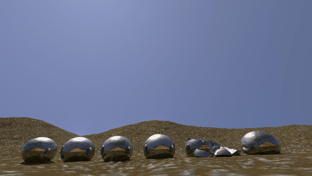
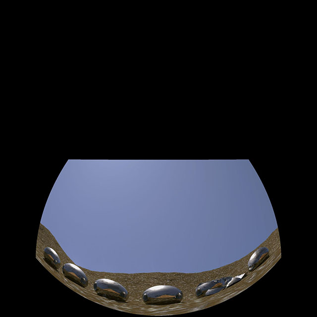

# Dome2rect v1.6 - 2016-08-18 #
by Andrew Hazelden

## Overview ##
Dome2rect is a command line script that uses the open source Panotool library + MPRemap  application to automate the process of converting image sequences between multiple panoramic formats. I created this script because I wanted to make it simpler to convert a fulldome movie trailer into a "flat screen" rectilinear format for posting on sites like YouTube.

**Note:** Windows 7 or higher is required to use the tools.

*Dome2rect is distributed under the GPL v3 license.*

## Version History ##

### Changes in Version 1.6 ###

New in Dome2rect version 1.6 is a `latlong2gearvrmono.bat` script that converts latlong/equirectangular/spherical imagery into the Gear VR mono horizontal strip cubemap image format. The `cubic2gearvrmono.bat` script converts 6 cubemap images into a Gear VR mono horizontal strip cubemap image format. Updated the scripts to automatically create the output folder if required. Updated the file naming of the intermediate cubemap frames.

### Changes in Version 1.5 ###

New in Dome2rect version 1.5 is a `movie2imagesequence.bat` script that makes it easy to extract image sequences from any .mp4 movies placed in the dome2rect input folder. Also added a script `alphaextract.bat` that extracts a transparent mask from footage and saves it into an RGB image file in the output folder. The `encodemovie.bat` script will re-encode a mp4/mov/mkv/avi movie file with ffmpeg into a compact mp4 movie to make it playback better on mobile/tablets/desktop systems. The `imagesequence2movie.bat` script will turn your image sequence into an mp4 movie using ffmpeg.

### Changes in Version 1.4 ###

New in Dome2rect version 1.4 is support for converting LatLong Stereo images into the Gear VR Stereo cubic format, and a LatLong to mental ray cube1 horizontal strip format conversion.

### Changes in Version 1.3 ###

New in Dome2rect version 1.3 is support for LatLong to cubic, horizontal cross, vertical cross, and cubemap3x2 conversions.

## Download ##

The dome2rect program is an open source program that is a free download. A sample fulldome image sequence is included.

You can download the latest version from the dome2rect page:   
[http://www.andrewhazelden.com/blog/2013/08/dome2rect](http://www.andrewhazelden.com/blog/2013/08/dome2rect)

## Installation ##

For the software to work it has to be expanded and moved to the folder:  
> C:\dome2rect

## Image Conversion Example ##

The dome2rect conversion process works by reading fulldome formatted imagery from the **C:\dome2rect\input** folder and saving the converted rectilinear frames to the **C:\dome2rect\output** folder. Let's convert the included fulldome angular fisheye sample image sequence named (**zosma.0000.jpg** - **zosma.0035.jpg**) to a flattened rectilinear format.     

**Fulldome Sample Image**  
  

**Step 1.**  Edit the batch script file dome2rect.bat using a text editor. Type in your current input and output image filenames.

  

**Step 2.**  Double click on the dome2rect.bat program to start the conversion process.

  

**Step 3.** The script will start and begin converting the imagery. A progress screen displays the status as the mpremap utility converts the current frame. (When the program gets to the end of your image sequence you will get a generic warning indicating mpremap couldn't find the next image.)

  

**Step 4.** When the conversion process is complete we can review the image sequence that was generated in the "output" folder. If you are running Windows 7 you can use the included review.bat movie viewer.

**dome2rect.bat Output Image**:  
  
This image was created using a dome to rectilinear conversion.
## Converting 1080p HD Media to Fulldome ##

The rect2dome.bat script can be used to convert a 1080p HD JPEG or PNM image sequence into a fulldome formatted fisheye projection.

The final output image resolution and the image positioning is controlled by editing the **rect2dome** script in the `C:\dome2rect\scripts\` folder.

A sample rectilinear to domemaster image sequence conversion, named **rect2dome.0000.jpg** to **rect2dome.0035.jpg**, is included in the `C:\dome2rect\output` folder.

**rect2dome.bat Input Image**:  
  
This is the input image for the rectilinear to dome conversion.

**rect2dome.bat Output Image**:  
  
This image was re-projected into a domemaster fisheye format.

When the rect2dome output image is viewed in a fulldome simulator it looks like this:

**Note:** The [Domemaster Stereo shader tool "Dome Viewer"](https://github.com/zicher3d-org/domemaster-stereo-shader/wiki/DomeViewer) was used to preview the rect to dome conversion.

* * *

## Batch Script Notes ##
Right now the only image format enabled for input/output is .jpg files and a UNIX .pnm image format.

I created the following example .bat scripts to show what is possible:

**alphaextract.bat**  
This script extracts a transparent mask from footage and saves it into an RGB image file in the output folder.

**angular2cyl.bat**  
Converts a an angular fisheye image to a cylindrical image.

**angular2latlong.bat**  
Converts an angular fisheye image to a latlong/equirectangular/spherical image.

**cubic2gearvrmono.bat**  
Converts 6 cubemap images into a Gear VR mono horizontal strip cubemap.

**dome2rect.bat**  
Converts a 180 degree domemaster format angular fisheye image to a rectilinear image format.

**encodemovie.bat**  
Re-encode a mp4/mov/mkv/avi movie file with ffmpeg into a compact mp4 movie to make it playback better on mobile/tablets/desktop systems.

**imagesequence2movie.bat**  
This script will take an image sequence along with an audio file and create an mp4 movie file using ffmpeg.

**latlong2cubemap3x2.bat**  
Converts a latlong/equirectangular/spherical image to a cubic format that has a single image output with a Cubemap 3x2 arrangement with 3 cubic faces on the top row, and 3 cubic faces on the bottom row. 

The Cubemap 3x2 format was popularized by [Garden Gnome Software's Pano2VR](http://ggnome.com/pano2vr) Panoramic tools.

**latlong2cubic.bat**  
Converts a latlong/equirectangular/spherical image to a set of 6 cubic face images.

**latlong2cyl.bat**  
Converts a latlong/equirectangular/spherical image to a cylindrical image.

**latlong2dome.bat**  
Converts a latlong/equirectangular/spherical image to a fulldome image.

**latlong2gearvrmono.bat**  
Converts latlong/equirectangular/spherical image into a Gear VR mono horizontal strip cubemap image format.

**latlong2horizontalcross.bat**  
Converts a latlong/equirectangular/spherical image to a cubic format that has a single image output with a horizontal cross arrangement.

**latlong2mentalrayhorizontalstripcube1.bat**  
Converts a latlong/equirectangular/spherical image into a cubic format that has a single image output with a mental ray cube1 horizontal strip arrangement.

**latlong2rect.bat**  
Converts a latlong/equirectangular/spherical image to a rectilinear image.

**latlong2verticalcross.bat**  
Converts a latlong/equirectangular/spherical image to a cubic format that has a single image output with a vertical cross arrangement.

**latlongstereo2gearvrstereo.bat**  
Converts a pair of latlong/equirectangular/spherical stereo images into a cubic format that has a single image output with a Samsung GearVR Stereo horizontal strip arrangement.

The left LatLong frames in the image sequence should be named `<name>_L.#.jpg`, and the right LatLong frames in the image sequence should be named `<name>_R.#.jpg`.

**movie2imagesequence.bat**  
Extract image sequence frames from all of the .mp4 movie files in the input folder using ffmpeg.

**rect2dome.bat**  
Converts a rectilinear image to a fisheye image

**review.bat**  
Simple playback program to view the image output. This tool uses ffmpeg's playback tool.

## PT Conversion Scripts ##

Internally the image projections are done using the mpremap library by Helmut Dersch:
[http://webuser.fh-furtwangen.de/~dersch/mp/MotionPanoramas.html](http://webuser.fh-furtwangen.de/~dersch/mp/MotionPanoramas.html)

The conversion scripts are stored in the **scripts/** folder and are written using the Panotools PT Stitcher syntax:
[http://wiki.panotools.org/PTStitcher](http://wiki.panotools.org/PTStitcher)

This example panotools conversion script takes an equidistanst fisheye image and converts it to a 1920x1080p rectilinear image output. The image is rolled -10 degrees, and pitched 55 degrees.

<pre><code># Defish fulldome image to a 1080p HD format:  
p f0 w1920 h1080 v90  
o f3 v180 r-10 y0 p55  
m i2  
</code></pre>

This example panotools conversion script takes an angular fisheye image and converts it to a 2160x1080 cylindrical image output. The image is pitched 90 degrees.

<pre><code># Defish image to a cylindrical 1080p format:
p f1 w2160 h1080 v360
o f3 v360 r0 y0 p90 b0
m i2
</code></pre>

This example panotools conversion script takes an angular fisheye image and converts it to a 2048x1024 latitude longitude (equirectangular) image output. The image is pitched 90 degrees.

<pre><code># Defish image to a latlong 1024p format:
p f2 w2048 h1024 v360
o f3 v360 r0 y0 p90 b0
m i2
</code></pre>

This example panotools conversion script takes a latitude longitude (equirectangular) image and converts it to a 1920x1080p rectilinear image output.

<pre><code># latlong image to a 1080p HD format:
p f0 w1920 h1080 v90  
o f4 v360 r0 y0 p0  
m i2  
</code></pre>

This example panotools conversion script takes a latitude longitude (equirectangular) image and converts it to a 1080x1080 fulldome angular fisheye image output. The image is pitched -90 degrees.

<pre><code># latlong to fulldome fisheye 1080x1080 format:
p f3 w1080 h1080 v180
o f4 v360 r0 y0 p-90
m i2
</code></pre>

Here is a quick summary of the PT Stitcher syntax:
<pre><code>'p' = Destination Image Attributes

'p' Attributes:
C0,960,420,960 = Crop Dimensions left,right,top,bottom
f0 = projection mode  0 = rectilinear
f1 = projection mode  1 = cylindrical
f2 = projection mode  2 = equirectagular/latlong
f3 = projection mode  3 = fullframe fisheye

w1920 = destination width 1920 px
h1080 = destination height 1080 px
v90 = horizontal field of view = 90 degrees

'o' = Source Image Attributes

'o' Attributes:
f0 = projection mode 0 = rectilinear
f3 = projection mode 3 = equidistant fisheye
f4 = projection mode 4 = equirectagular/latlong
f5 = projection mode 5 = circular fisheye
f10 = projection mode 10 = equisolid fisheye

r-10 = roll the image -10 degrees (left)
y22 = yaw the image 22 degrees
p45 = pitch the image 45 degrees

b0.1 or b0.5 = barrel distort correct 
= useful ranges from -1.0 to 1.0

m = Image Anti-Aliasing

'm' Attributes:

m i2 = smooth spline36 interpolation of the converted imagery

</code></pre>

### Changing Input & Output File Names ###

To change the name of the input and output files you can edit the .bat scripts using a plain text editor. All image sequences start on frame number 0 (eg. 0.jpg)  

To convert a single frame image enter the exact image name. (eg. image.jpg) 
 
To convert an unpadded image sequence use the value %%d.jpg (eg. 9.jpg )  

To convert an a 4 digit padded image sequence use the value %%.4d.jpg (eg: 0009.jpg)  

If you want the dome2rect script to process a single frame for testing change the following code:  

> @set ptscript=dome2rect  
> @set input=input\zosma.0001.jpg  
> @set output=output\sequence.%%d.jpg  

If you want the dome2rect script to process a 4 digit padded image sequence change the following code:   

> @set ptscript=dome2rect  
> @set input=input\zosma.%%.4d.jpg  
> @set output=output\sequence.%%d.jpg  

* * *

## About the Tool ##

I was inspired to make this after reading Jason Fletcher's blog post on converting fulldome movies for display on flat screens:
[http://thefulldomeblog.com/2013/06/29/defishing-for-flat-screens/](http://thefulldomeblog.com/2013/06/29/defishing-for-flat-screens/)

Cheers,  
Andrew Hazelden  

eMail: [andrew@andrewhazelden.com](mailto:andrew@andrewhazelden.com)   
Blog: [http://www.andrewhazelden.com](http://www.andrewhazelden.com)  
Twitter: [@andrewhazelden](https://twitter.com/andrewhazelden)  
Google+: [https://plus.google.com/+AndrewHazelden/](https://plus.google.com/+AndrewHazelden/)

